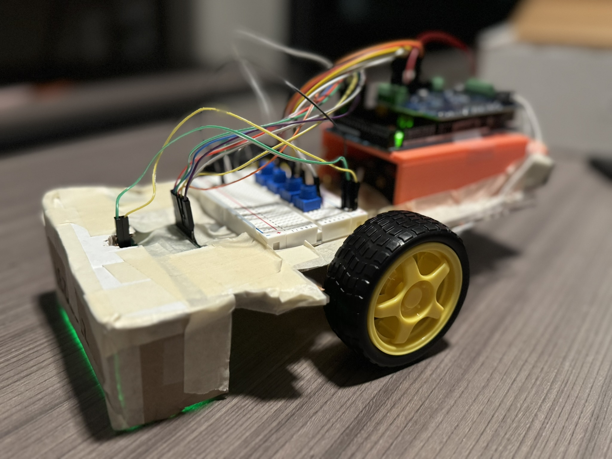

# Autonomous Line-Following Robot

A custom-PCB line-following robot built for the EE 201 capstone at the University
of Washington — a one-month, build-from-scratch competition to design the fastest,
most accurate line follower in the class.

**Full writeup:** https://ae0lis.github.io/projects/line_robot/

## Overview

The robot follows a black line on a light surface using a custom seven-channel
photoresistor array, processes the readings through a PID controller on an Arduino,
and steers by driving its two motors at differing speeds. Built by a three-person
team over one month; completed the full competition track.

## Repository structure

| Path | Contents |
|------|----------|
| `kicad/` | KiCad project — schematic, board layout, and netlist for the sensor array |
| `kicad/PCB_share/` | Gerber + drill files for fabrication (open in any Gerber viewer, no KiCad needed) |
| `firmware/` | Arduino control code (see note below) |
| `renders/` | Exported schematic and 3D board renders |
| `images/` | Photos of the assembled robot |

## The sensor board

The core of the project is a custom PCB I designed and laid out in KiCad:

- **Seven-channel photoresistor array** — each channel pairs a photoresistor with an
  LED, flooding the surface with consistent light so a change in reading reflects
  floor color rather than ambient light or shadow.
- **Per-LED current limiting** — each LED has its own 1 kΩ resistor.
- **Copper pours** for GND and VCC instead of hand-routed power traces, which helped
  keep the board compact (40 × 80 mm between mounting holes).
- **Sensor outputs map to Arduino analog pins A8–A14**, matching the firmware.

## Firmware

The control firmware is based on PID scaffolding provided to all teams in the course.
My contribution here was mapping the controller to this board's pin assignments,
configuring it, and tuning the PID constants against the competition track. Both
files are included for transparency:

- `10_5_line_follower_code_template.ino` — the course-provided starting point
- `10_5_line_follower_code_completed.ino` — the filled-in, tuned version used in the robot

Tuned constants at competition: S 30, P 24, I 0, D 24.
Calibrated sensor readings: ~2500 on black, ~1000 on white.

## Viewing the board

- **Renders:** the PNGs in `renders/` show the schematic and 3D board.
- **Gerbers:** open `kicad/PCB_share/` in any Gerber viewer to inspect the manufacturing layers.
- **Source:** open `kicad/Final_Project_PCB.kicad_pro` in KiCad 9.0 or newer. 
			  May work on older versions, but no promises!

## Team

Built by Dat Ly, Michael Zhang, and Ben Robison for EE 201 (University of Washington).
I (Ben) was responsible for the sensor PCB, firmware configuration and tuning, and much of
the physical assembly.
